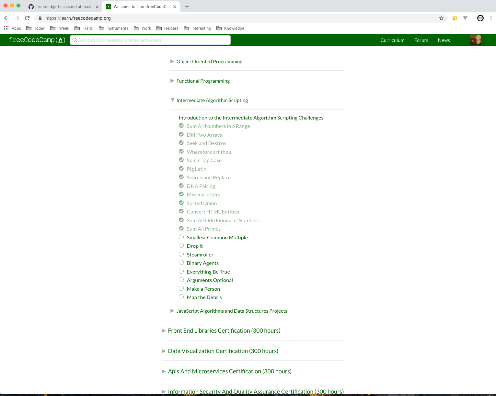

I liked https://learngitbranching.js.org . This resourse improve my knowledge about git commands, helped remember some options og git that I hadn't used. I made some tip for me, but maybe it will hep someone else :)

<ul>
  <li>
    reset - undoing changes
  </li>
  <li>
    revert - add new commit with some changes for all who work on current branch
  </li>
  <li>
    rebase - change branch with prew commit 
  </li>
  <li>
    cherry-pick - clone some commits in current place (HEAD)
  </li>
  <li>
    rebase -i - change commit how would you like
  </li>
  <li>
    tag - permalink
  </li>
  <li>
    fetch - synс local and remote
  </li>
</ul>

----------------------------------------------------------------

## Linux CLI, and HTTP

CLI - relly help if you want to make some little change in your filesystem or file. Also can help make commands easier if you want to configure your work environment. :) 

HTTP - shoud know everyone dev. In future we will know it in more details.

----------------------------------------------------------------

## Git Collaboration

I think this two task help me learn git in details. I have increased my knowledge about git log and learned more about work with remote repository.
In future I will definitely use git log --stat --oneline :)

----------------------------------------------------------------

## Intro to HTML and CSS

I have repeated information about HTML/CSS and it semantic value. 
In future I want to make product with full semantic, with semantic that seo developers will not broken :)

----------------------------------------------------------------

## Responsive Web Design

I have repeated information about responsive web design, studied info about optimization and other for good mobile page. 
Frog, frog :) Already played, but also interesting

----------------------------------------------------------------

## JS Basics

I have repeated basic information about JS. 
Task with algorith was interesting. Understand that in free time I need to solve task like this because it fun and useful for work

----------------------------------------------------------------

## DOM

I have practice task, try to more understand callback function. Need learn about it more :)
Now I know, that  async/await give us really syntax sugar.

----------------------------------------------------------------

## A Tiny JS World

[Demo](https://justdevway.github.io/a-tiny-JS-world/)
 
[Code base](https://github.com/kottans/frontend-2019-homeworks/blob/master/submissions/justdevway/a-tiny-JS-world/index.js)
 
Reviewed and approved by @OleksiyRudenko 

Now I more understand how to work with object and how to correct to divide some instance to other instance.

