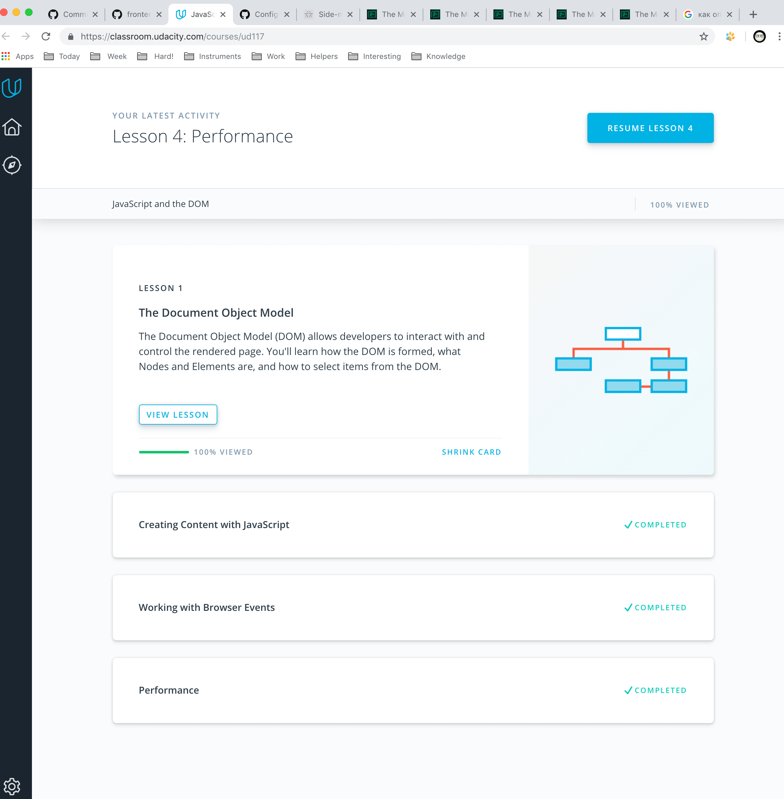
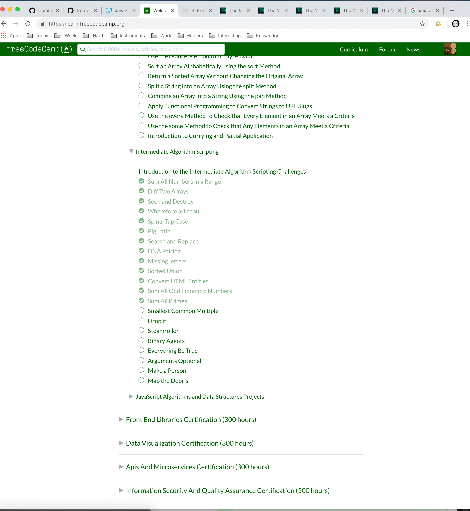

----------------------------------------------------------------

## DOM

I have practice task, try to more understand callback function. Need learn about it more :)
Now I know, that  async/await give us really syntax sugar.